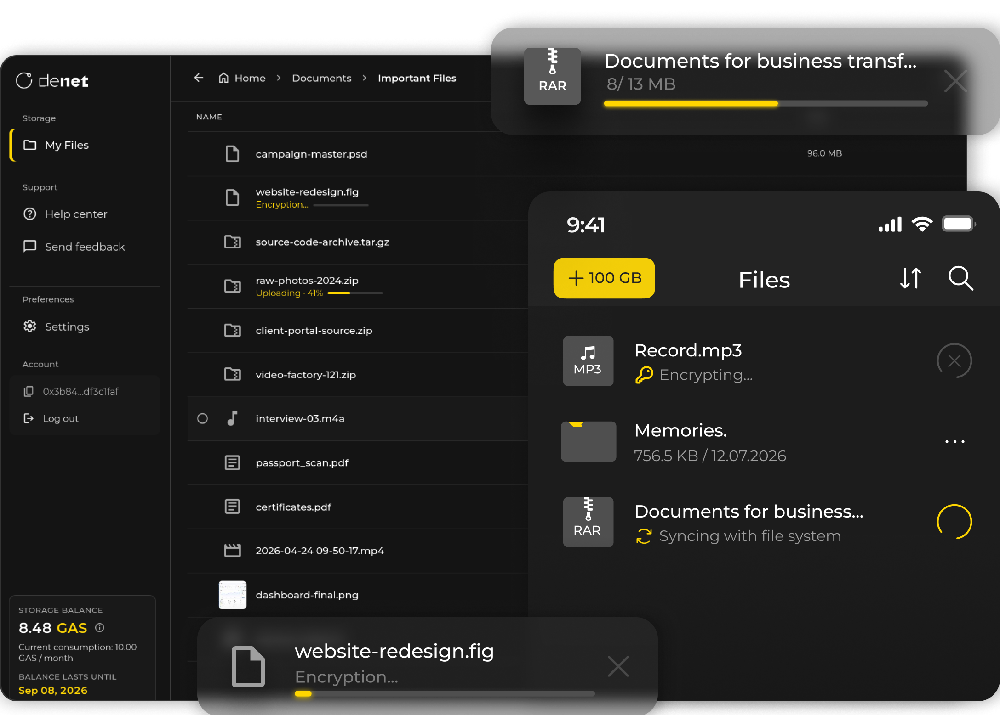

<div align="center">


# DeNet Storage Desktop

Client-side encrypted, private cloud storage for Windows, macOS, and Linux.

[](https://github.com/DeNetPRO/Desktop-Storage/releases/latest)
[](https://github.com/DeNetPRO/Desktop-Storage/releases/latest)
[](https://denet.pro)

[Download](#get-the-app) • [Features](#key-features) • [How Data is Stored](#how-data-is-stored) • [FAQ](#frequently-asked-questions) • [Mobile App](https://mobile.denet.app) • [Website](https://denet.pro)

<br/>



</div>

---

## What is DeNet?

**DeNet** is a decentralized storage protocol founded in 2017 that connects users needing private, secure storage with a global network of independent storage providers (Datakeepers). With over 7.5 million participants across 194 countries, DeNet eliminates reliance on centralized corporate data centers.

### DeNet Storage Desktop

**DeNet Storage Desktop** is the official desktop application for Windows, macOS, and Linux. It enables private file storage, automated backups, and cross-device sync using a **zero-knowledge architecture**:

1. **Splitting into parts:** Files are split locally on your device into 1 MB parts.
2. **Client-side encryption:** Each part is individually encrypted with AES-256 before leaving your computer. Only you hold the decryption keys.
3. **Erasure coding into shards:** Encrypted parts are coded into redundant 1 MB shards using Reed-Solomon parity.
4. **Distributed storage:** Shards are stored across 2,000+ independent Datakeeper nodes worldwide. No single node holds your complete file or has access to your data.

---

## Get the App

Direct installers for the latest official desktop release:

| Platform | Architecture | Package |
| :--- | :--- | :--- |
| **Windows** | 64-bit (x86_64) | [Download .exe installer](https://github.com/DeNetPRO/Desktop-Storage/releases/latest) |
| **macOS** | Apple Silicon (ARM64) | [Download ARM64 .dmg](https://github.com/DeNetPRO/Desktop-Storage/releases/latest) |
| **macOS** | Intel (x86_64) | [Download Intel .dmg](https://github.com/DeNetPRO/Desktop-Storage/releases/latest) |
| **Linux** | x86_64, ARM64 | [.deb](https://github.com/DeNetPRO/Desktop-Storage/releases/latest) • [.rpm](https://github.com/DeNetPRO/Desktop-Storage/releases/latest) |

### Windows
1. Download the `DeNet-Storage-Setup.exe` installer from [Releases](https://github.com/DeNetPRO/Desktop-Storage/releases/latest).
2. Run the installer and follow the setup prompts.
3. Open **DeNet Storage** from the Start Menu.

### macOS
1. Apple Silicon (M-series): download the `DeNet Storage_<version>_aarch64.dmg` release asset.
2. Intel: download the `DeNet Storage_<version>_x64.dmg` release asset.
3. Open the `.dmg` file and drag **DeNet Storage** into your **Applications** folder.
4. Open **DeNet Storage** from Launchpad or Spotlight.

### Linux

```bash
# Ubuntu / Debian (.deb)
sudo dpkg -i "DeNet Storage_"*.deb

# Fedora / RHEL (.rpm)
sudo rpm -i "DeNet Storage-"*.rpm
```

---

## Key Features

- **Zero-Knowledge Privacy:** Files are encrypted and decrypted locally. The network never receives unencrypted data or private keys.
- **Decentralized Infrastructure:** Eliminates single points of failure. Shards are stored across 2,000+ independent nodes in 194 countries rather than in a single corporate data center.
- **Pay-as-You-Go Storage:** Add funds to your balance and pay only for the space and time you use. No fixed monthly plans or fees for unused space.
- **Automated Folder Backups:** Point the app at any folder to keep documents, media, and projects backed up in the background.
- **High Data Durability:** Thanks to parity coding, your files stay safe and downloadable even if multiple storage nodes go offline.
- **Cross-Device Access:** View and manage your files on mobile using the [DeNet Mobile App](https://mobile.denet.app).

---

## Traditional Cloud vs DeNet Storage

| Dimension | Traditional Cloud Storage | DeNet Storage |
| :--- | :--- | :--- |
| **Encryption** | Handled remotely on company servers | Handled locally on your device |
| **Key Custody** | Provider holds decryption keys | Only you hold your private keys |
| **Storage Infrastructure** | Centralized data centers | 2,000+ distributed nodes worldwide |
| **Pricing** | Fixed monthly or yearly subscriptions | Pay only for the space you use |
| **Network Outages** | Provider outage stops access | Files rebuilt automatically from parity nodes |

---

## How Data is Stored

```text
Local File
   │
   ▼
1. Split into 1 MB Parts
   │
   ▼
2. AES-256 Client-Side Encryption
   │
   ▼
3. Reed-Solomon Erasure Coding
   │
   ├───> Node A (Encrypted Shard 1)
   ├───> Node B (Encrypted Shard 2)
   ├───> Node C (Encrypted Shard 3)
   └───> Node D (Parity Shard)
```

When downloading, the desktop client queries the network, pulls the fastest available shards, verifies their cryptographic integrity, reconstructs the original file, and decrypts it locally.

---

## System Requirements

| Operating System | Minimum Version | Architecture |
| :--- | :--- | :--- |
| **Windows** | Windows 10 / 11 | 64-bit (x86_64) |
| **macOS** | macOS 11 (Big Sur) or newer | Apple Silicon (ARM64) |
| **macOS** | macOS 11 (Big Sur) or newer | Intel (x86_64) |
| **Linux** | Ubuntu 20.04+, Debian 11+, Fedora 36+, Arch | x86_64, ARM64 |
| **Hardware** | 512 MB RAM, ~200 MB disk space | Any modern processor |

---

## Frequently Asked Questions

**Can DeNet restore my files if I lose my private keys or recovery phrase?**  
No. Encryption happens strictly on your device. Because DeNet never receives your private keys or unencrypted data, neither DeNet nor any third party can recover your files or reset access. Keep your recovery phrase in a safe place.

**How does pay-as-you-go pricing work compared to monthly plans?**  
Instead of charging a fixed monthly subscription (such as paying for 2 TB when you only use 100 GB), storage cost is deducted from your balance based on the exact space and time your files use (minimum storage is calculated as 100 GB).

**What happens if storage nodes go offline?**  
DeNet uses an automatic replication mechanism. The network continuously monitors shard availability, and if a node goes offline, the system automatically replicates missing shards to other active nodes to maintain redundancy. In addition, Reed-Solomon parity ensures your files remain instantly downloadable.

**Is there a file size limit for uploads?**  
There is no file size limit. The desktop client streams large archives, media, and backups in 1 MB parts directly to the network.

**How does syncing with the mobile app work?**  
The desktop client and the [DeNet Mobile App](https://mobile.denet.app) share the same decentralized storage protocol. By opening the same account on mobile, you can view, upload, and manage your files, photos, and documents across all your devices.

**Can DeNet or node providers scan or analyze my files?**  
No. Files are encrypted on your device with AES-256 before upload and distributed across independent nodes. Neither DeNet, node providers, nor any third party can access, scan, or view your data, as only you hold the decryption keys.

**How can I provide storage capacity and earn rewards?**  
If you want to provide disk space and earn rewards as a Datakeeper, visit the [Datakeeper Node Sale](https://nodesale.denet.app) for licenses and setup details.

---

## Ecosystem

- **[DeNet Website](https://denet.pro):** Official website, protocol architecture, and network statistics.
- **[DeNet Mobile](https://mobile.denet.app):** Companion mobile app for iOS and Android.
- **[Datakeeper Node Sale](https://nodesale.denet.app):** Get a Datakeeper license to provide storage capacity and earn rewards.

---

## Support

- **Issue Tracker:** For bug reports and feature requests, please open a [GitHub Issue](https://github.com/DeNetPRO/Desktop-Storage/issues).
- **Website & Updates:** Visit [denet.pro](https://denet.pro) to learn more about the network.
